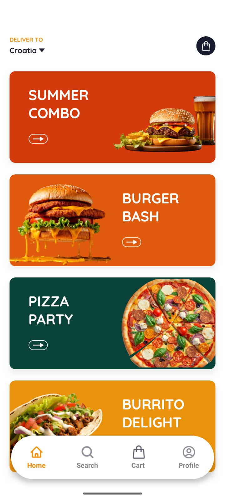
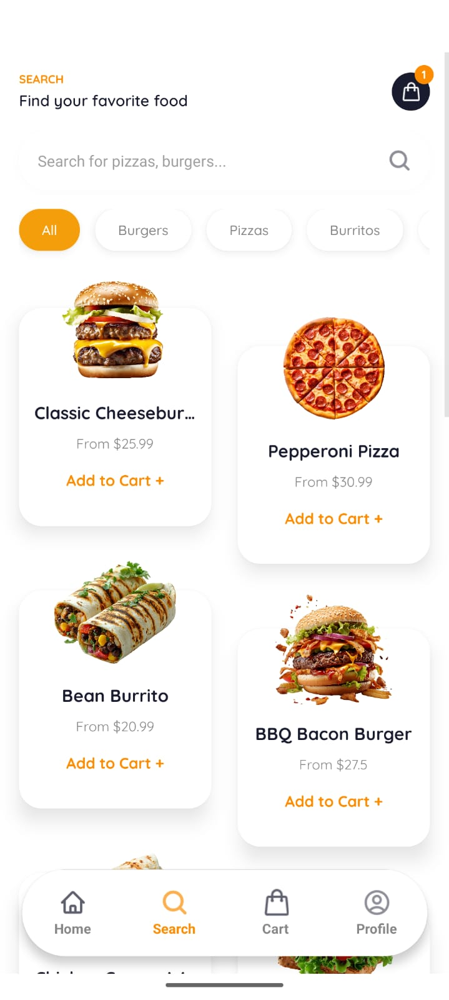
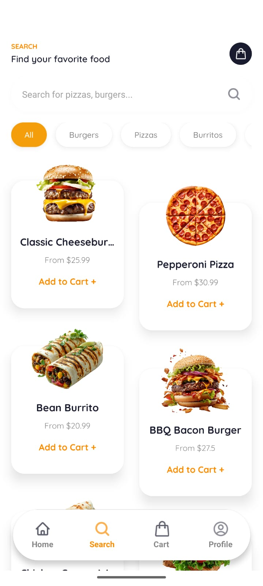
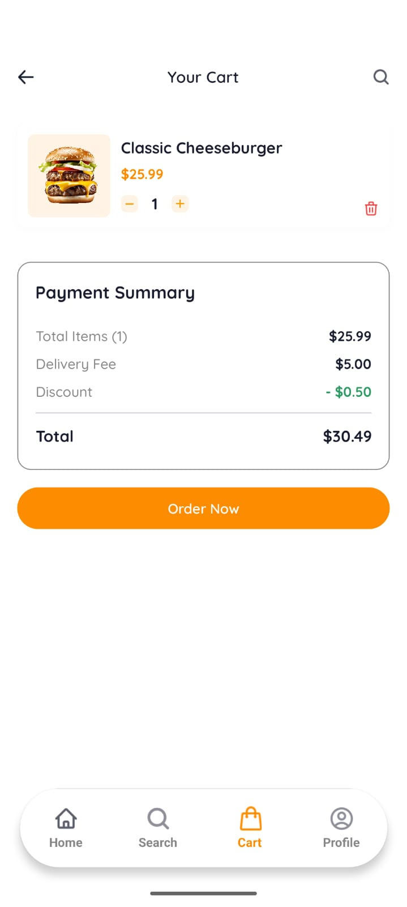
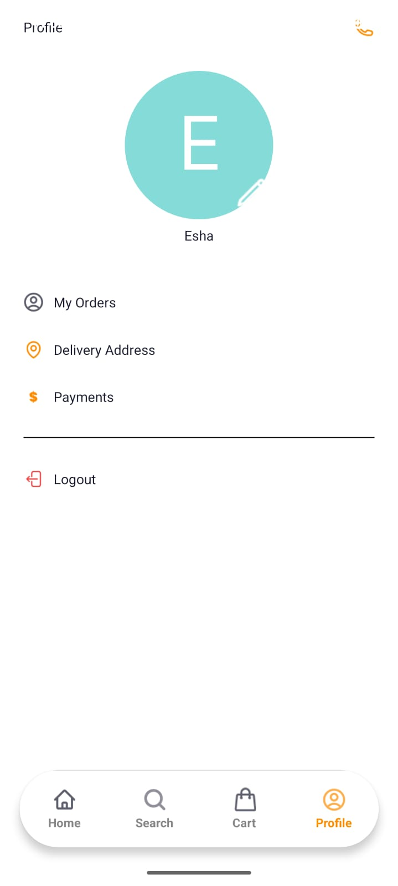

# 🍔 Food Ordering Mobile App

A **production-style cross-platform food ordering mobile application** built using **Expo + React Native**.  
The app demonstrates real-world UI/UX patterns, scalable architecture, and clean code practices used in modern mobile development.

> Built to showcase practical React Native skills, Expo ecosystem knowledge, and end-to-end feature implementation.

---

## 🚀 Project Highlights

- 📱 Cross-platform app (Android & iOS)
- 🧭 File-based routing with **Expo Router**
- 🔐 Authentication flows (Sign Up / Sign In)
- 🏠 Home with promotions & categories
- 🔍 Food search & filtering
- 🛒 Cart & checkout with dynamic pricing
- 👤 User profile & account actions
- 🧱 Clean, scalable project architecture
- ⚡ Performance-optimized UI components

---

## 📸 App Screenshots

### 🔐 Authentication
| Sign Up | Sign In |
|-------|--------|
|  |  |

---

### 🏠 Home & Offers
| Home | Promotions |
|-----|-----------|
|  |  |

---

### 🔍 Search & Browse
| Search | Categories |
|-------|------------|
|  |  |

---

### 🛒 Cart & Checkout
| Cart | Payment Summary |
|------|----------------|
|  |  |

---

### 👤 Profile
| Profile |
|--------|
|  |

---

## 🧩 Features Breakdown

### 🔐 Authentication
- Sign Up & Sign In screens
- Input validation-ready architecture
- Easily extendable for OAuth / OTP login

### 🏠 Home
- Delivery location selector
- Promotional banners
- Category-based browsing

### 🔍 Search
- Search food items by name
- Filter by food category
- Clean card-based UI layout

### 🛒 Cart & Checkout
- Add/remove items
- Quantity controls
- Dynamic price calculation
- Delivery fee & discount logic

### 👤 Profile
- User overview
- Orders, address & payments placeholders
- Logout functionality

---

## 🧱 Project Architecture

```text
app/
├── (auth)/
│   ├── sign-in.tsx
│   └── sign-up.tsx
├── (tabs)/
│   ├── home.tsx
│   ├── search.tsx
│   ├── cart.tsx
│   └── profile.tsx
├── components/
│   ├── FoodCard.tsx
│   ├── CategoryChip.tsx
│   └── CartItem.tsx
├── constants/
├── hooks/
├── utils/
├── assets/
│   └── screenshots/
└── app.config.ts
````

✔ Modular & scalable
✔ Clear separation of concerns
✔ Easy backend integration

---

## 🛠 Tech Stack

| Category  | Technology                                |
| --------- | ----------------------------------------- |
| Framework | Expo (React Native)                       |
| Routing   | Expo Router                               |
| Language  | TypeScript                                |
| Styling   | React Native StyleSheet                   |
| State     | Local State (extendable to Redux/Zustand) |
| Platform  | Android & iOS                             |

---

## 🧪 Getting Started

### 1️⃣ Install Dependencies

```bash
npm install
```

### 2️⃣ Start the App

```bash
npx expo start
```

Run on:

* Android Emulator
* iOS Simulator
* Physical device via **Expo Go**

---

## 📈 What This Project Demonstrates

* Real-world mobile app development workflow
* Strong understanding of **React Native fundamentals**
* Expo ecosystem proficiency
* UI/UX driven component design
* Clean, readable, and maintainable code
* Scalable architecture suitable for production apps

---

## 🔮 Future Enhancements

* Backend integration (Node.js / Appwrite / Firebase)
* JWT / OAuth authentication
* Online payments (Stripe / Razorpay)
* Order history & live tracking
* Push notifications

---

## 👩‍💻 Developer

**Esha**
Software Developer | Full Stack & Mobile Applications

* React & React Native
* TypeScript & JavaScript
* Node.js & API integration
* Clean architecture & scalable systems

---

## 📚 References

* Expo Documentation
  [https://docs.expo.dev/](https://docs.expo.dev/)

* Expo Router
  [https://docs.expo.dev/router/introduction/](https://docs.expo.dev/router/introduction/)

* React Native Docs
  [https://reactnative.dev/docs/getting-started](https://reactnative.dev/docs/getting-started)

* Mobile UX Guidelines
  [https://material.io/design](https://material.io/design)

---

### 📌 If you like this project, feel free to ⭐ the repository!

```
